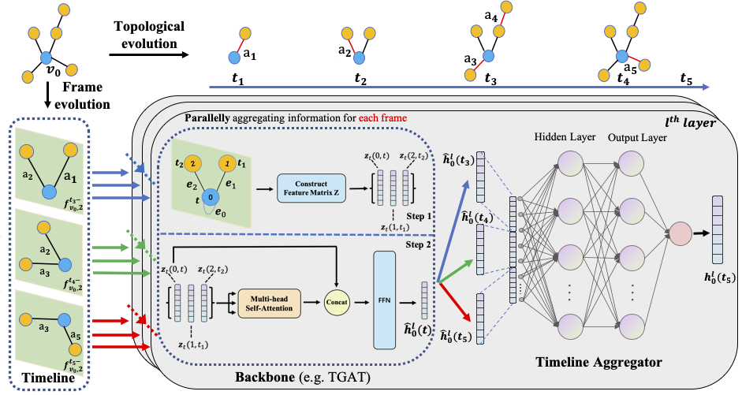

## FTM: A Frame-level Timeline Modeling Method for Temporal Graph Representation Learning

PyTorch Implementation of paper:

> **FTM: A Frame-level Timeline Modeling Method for Temporal Graph Representation Learning (AAAI 2023)**
> 
> Bowen Cao\*, Qichen Ye\*, Weiyuan Xu, Yuexian Zou. (\* denotes equal contribution)



## Introduction
Learning representations for graph-structured data is essential for graph analytical tasks. While remarkable progress has been made on static graphs, researches on temporal graphs are still in its beginning stage. The bottleneck of the temporal graph representation learning approach is the neighborhood aggregation strategy, based on which graph attributes share and gather information explicitly. 

Existing neighborhood aggregation strategies fail to capture either the short-term features or the long-term features of temporal graph attributes, leading to unsatisfactory model performance and even poor robustness and domain generality of the representation learning method. To address this problem, we propose a Frame-level Timeline Modeling (FTM) method that helps to capture both short-term and long-term features and thus learns more informative representations on temporal graphs. 

In particular, we present a novel link-based framing technique to preserve the short-term features and then incorporate a timeline aggregator module to capture the intrinsic dynamics of graph evolution as long-term features. Our method can be easily assembled with most temporal GNNs. Extensive experiments on common datasets show that our method brings great improvements to the capability, robustness, and domain generality of backbone methods in downstream tasks.

Paper link: [ArXiv](https://arxiv.org/abs/2302.11814)
## Running the experiments
### Requirements

Dependencies (with python >= 3.7):

```{bash}
pandas==1.1.0
torch==1.6.0
scikit_learn==0.23.1
```

### Dataset and Preprocessing

#### Download the public data
Download the sample datasets (eg. wikipedia and reddit) from
[here](http://snap.stanford.edu/jodie/) and store their csv files in a folder named
```data/```.

#### Preprocess the data
We use the dense `npy` format to save the features in binary format. If edge features or nodes 
features are absent, they will be replaced by a vector of zeros. 
```{bash}
python utils/preprocess_data.py --data wikipedia --bipartite
python utils/preprocess_data.py --data reddit --bipartite
```

#### ***TL;DR*** Download our preprocessed data here: [link](https://drive.google.com/file/d/18ZwwU3dLI4bCQ4zG4MmgTXkGiJlDI_1h/view?usp=sharing) , then put all the files in `/path/to/data_fold/`


## Model Training
```shell
# TGAT-FTM
bash scripts/run_TGAT-FTM.sh

# TGN-FTM
bash scripts/run_TGN-FTM.sh
```
Please customize the `PATH_PREFIX` before running the script.


## Acknowledgment
This repo is built upon the following work:
```
TGN: Temporal Graph Networks  
https://github.com/twitter-research/tgn

Inductive Representation Learning on Temporal Graphs 
https://github.com/StatsDLMathsRecomSys/Inductive-representation-learning-on-temporal-graphs
```
Many thanks to the authors and developers!

## Cite Us
<pre>
@misc{https://doi.org/10.48550/arxiv.2302.11814,
  doi = {10.48550/ARXIV.2302.11814},
  
  url = {https://arxiv.org/abs/2302.11814},
  
  author = {Cao, Bowen and Ye, Qichen and Xu, Weiyuan and Zou, Yuexian},
  
  keywords = {Machine Learning (cs.LG), Social and Information Networks (cs.SI), FOS: Computer and information sciences, FOS: Computer and information sciences},
  
  title = {FTM: A Frame-level Timeline Modeling Method for Temporal Graph Representation Learning},
  
  publisher = {arXiv},
  
  year = {2023},
  
  copyright = {Creative Commons Attribution 4.0 International}
}

</pre>